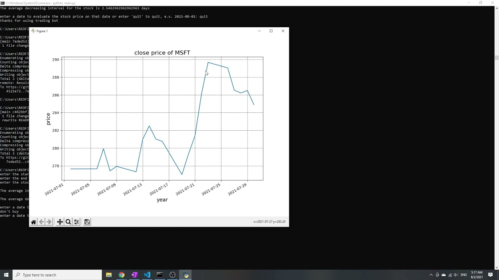

# tradingBot

## Video Demonstration

## Project Overview
A trading bot that analyzes a period of stock price data of certain stock, then takes a date as input and outputs whether one should buy or sell the stock based on the stock price on that day

## What it does
trading bot: the trading bot performs the following functions:
1. [x] determines whether a stock price on a certain day is a good entry or exit point for the stock based on analysis on the stock's past history
2. [ ] periodically filters out tweets and news related to stocks according to user preference
3. [ ] keeps check on market price movement at every second across multiple financial instruments

## How We built it
We wrote the whole program using python. We first get stock price data through the API of Yahoo Finance. Then, we use dataFrame, numpy array, python list operations to operate on and analyze data so that we can extract useful data from the stock price data. In particular, we calculated the average increasing interval and the average decreasing interval of the stock specified by the user. then, we use these useful information to evaluate the stock prices the user specifies and determine whether the user should buy or sell at the price specified.